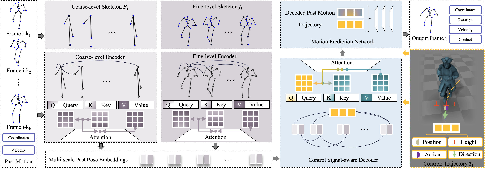

# Multi-Scale Control Signal-Aware Transformer for Motion Synthesis without Phase (MCS-T) 
Official Pytorch implementation of the paper "Multi-Scale Control Signal-Aware Transformer for Motion Synthesis without Phase" 



[Paper](https://arxiv.org/abs/2303.01685) ｜ Video (coming soon)

## Updates
**06/MAR/23** - Project initialized.

## Code
coming soon

## Acknowledgments
The C++ runtime demo codes are mostly taken from [Holden et al. [2017]](https://theorangeduck.com/page/phase-functioned-neural-networks-character-control).

The biped locomotion dataset is available at [Holden et al. [2017]](https://theorangeduck.com/page/phase-functioned-neural-networks-character-control).

## Citation
If you find our paper is useful for your research, please cite:
```
@article{lintao2023mcst,
  title={Multi-Scale Control Signal-Aware Transformer for Motion Synthesis without Phase},
  author={Wang, Lintao and Hu, Kun and Bai, Lei and Ding, Yu and Ouyang, Wanli and Wang, Zhiyong},
  journal={arXiv preprint arXiv:2303.01685},
  year={2023}
}
